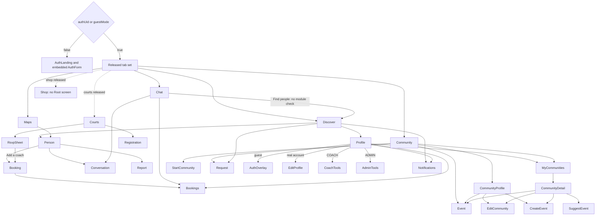

# Navigation and state-machine reachability audit

Date: 2026-09-17. Scope: `expo-app/src`, with the four released modules supplied in the request (`discover`, `maps`, `community`, `chat`) plus the off-tab Profile destination. This is a source audit, not a claim about the current production `my_modules` response. Only this report was written; no source, tests, configuration, or backend data were changed.

## Counts and definitions

| Category | Count | Evidence / meaning |
| --- | ---: | --- |
| Registered overlay IDs | 32 | `expo-app/src/navigation/OverlayRouter.tsx:47` through the last case at `expo-app/src/navigation/OverlayRouter.tsx:109`; aliases count separately. |
| Registered sheet IDs | 2 | `rsvp`, `myComm`: `expo-app/src/navigation/SheetRouter.tsx:7`, `expo-app/src/navigation/SheetRouter.tsx:9`. |
| Reachable registered IDs from the released app | 27 | All overlay rows marked reachable in the inventory below; some require a real account, coach/admin role, membership, or real data. |
| Unreachable registered IDs | 5 | **2 with no opener**: overlay `communityRegister`, sheet `myComm`. **3 in a disconnected component**: `adminAccounting`, `acctExpense`, `acctHistory`. See U1–U3. |
| Additional-module-only registered IDs | 2 | `registration` and `rsvp` require Courts; no entry from the four released tabs. See G1. These are separate from the five globally disconnected IDs. |
| Orphaned opened IDs | 2 overlays, 0 sheets | `shop`, `shopRegister`; their call sites exist in parked Shop code, but the router has no cases. See O1. |
| Broken overlay/sheet exits | 1 latent; 0 reachable in the four-module graph | `myComm` clears the wrong layer. It currently has no UI opener. See D1. No released overlay close/back writes an unknown destination. |
| Top-level tab/module navigation faults | 5 | T1–T5: no-module trap, missing Profile entry, Shop blank content, unknown module keys, withdrawn Discover target. Conditions are stated individually below. |
| Auth/onboarding findings | 4 confirmed code defects + 1 conditional integration gap | A1–A4 confirmed; A5 requires checking backend provisioning/SSO metadata. Several retain stale signup state for different reasons. |
| Other state-flow findings | 3 | S1–S3: account cache carryover, unhydrated My Communities, swallowed role-refresh failure. |
| Other workflow findings | 3 | F1–F3: RSVP coach handoff, wrong community return destination, unreachable create-event success branch. |
| State fields written after initialization but never read | 8 | W1 table below. Includes dormant actions; this is not eight independently reachable UI failures. |
| Additional unused initialization-only fields | 12 | W2 below: ten declared fields plus two extra initializer properties. |
| Dormant state readers with no non-default producer | 8 | W3 below: six retired coach/admin parameters and two registration seeds. All have initializers; none is an actually uninitialized property. |

Counts overlap where stated: D1 is also one of the unreachable IDs; O1 and T3 concern different layers of the same parked Shop feature. Do not add these category counts into a total number of independent defects.

## 1. Store fields that drive navigation or gating

The store is created directly with Zustand, without persistence middleware, at `expo-app/src/state/store.ts:528`. The generic setter accepts arbitrary **string values** for `tab`, `overlay`, and `sheet`; their types are not route-ID unions (`expo-app/src/state/store.ts:206`, `expo-app/src/state/store.ts:217`, `expo-app/src/state/store.ts:220`, `expo-app/src/state/store.ts:685`). Auth sessions and signup drafts have separate persistence (`expo-app/src/lib/supabase.ts:25`, `expo-app/src/lib/signup.ts:5`).

| Fields / initial state | Writers and readers; navigation/gating effect |
| --- | --- |
| `tab = 'discover'` | Initializer `expo-app/src/state/store.ts:529`; writers: module fallback `expo-app/src/navigation/Root.tsx:129`, tab selection `expo-app/src/navigation/TabBar.tsx:50`, Profile entry `expo-app/src/screens/DiscoverScreen.tsx:137`, Chat's Find people `expo-app/src/screens/ChatScreen.tsx:109`. Root consumes it at `expo-app/src/navigation/Root.tsx:135` and `expo-app/src/navigation/Root.tsx:158`. |
| `overlay = null` | Initializer `expo-app/src/state/store.ts:536`; complete writer inventory in section 3. Root mounts one overlay at `expo-app/src/navigation/Root.tsx:173`; unknown IDs return null at `expo-app/src/navigation/OverlayRouter.tsx:111`. |
| `sheet = null` | Initializer `expo-app/src/state/store.ts:537`; generic open/close at `expo-app/src/state/store.ts:1058`, `expo-app/src/state/store.ts:1059`; RSVP open at `expo-app/src/state/store.ts:1095`; identity change clears it at `expo-app/src/navigation/Root.tsx:55`. Root renders it **above** overlays at `expo-app/src/navigation/Root.tsx:175`. |
| `modules = []` | `expo-app/src/state/store.ts:530`; populated only by Root's `fetchVisibleModules` result (`expo-app/src/navigation/Root.tsx:123`, `expo-app/src/navigation/Root.tsx:126`). Controls screen rendering and tab visibility at `expo-app/src/navigation/Root.tsx:135`, `expo-app/src/navigation/TabBar.tsx:30`. Profile is exempt. |
| `authUid = null`, `guestMode = false` | Defaults `expo-app/src/state/store.ts:542`, `expo-app/src/state/store.ts:546`. Non-anonymous auth events set UID (`expo-app/src/navigation/Root.tsx:43`, `expo-app/src/navigation/Root.tsx:58`); guest completion sets `guestMode=true` (`expo-app/src/screens/AuthLanding.tsx:57`); real-account SIGNED_OUT sets it false (`expo-app/src/navigation/Root.tsx:60`). `authUid || guestMode` admits the app (`expo-app/src/navigation/Root.tsx:97`, `expo-app/src/navigation/Root.tsx:138`). |
| `role = 'USER'` | Reset on identity change (`expo-app/src/navigation/Root.tsx:52`); refreshed at `expo-app/src/state/store.ts:984`. Valid values are USER/COACH/ADMIN (`expo-app/src/state/models.ts:169`). Coach and admin tools are exposed only by the Profile checks at `expo-app/src/screens/ProfileScreen.tsx:97` and `expo-app/src/screens/ProfileScreen.tsx:156`; backend derivation is `expo-app/src/lib/queries.ts:401`. |
| `mode = 'coaches'` | `expo-app/src/state/store.ts:574`; role-pick write `expo-app/src/screens/AuthLanding.tsx:133`, Discover toggle `expo-app/src/screens/DiscoverScreen.tsx:159`, post-signup write `expo-app/src/navigation/Root.tsx:87`. Controls people collection, not authorization (`expo-app/src/state/store.ts:734`, `expo-app/src/screens/MapsScreen.tsx:25`). |
| `signupIntent = null`, `signupSports = []` | Defaults `expo-app/src/state/store.ts:533`; role/interests writes `expo-app/src/screens/AuthLanding.tsx:131`, `expo-app/src/screens/AuthLanding.tsx:140`, inline account writes `expo-app/src/overlays/AuthOverlay.tsx:102`, `expo-app/src/overlays/AuthOverlay.tsx:107`. Converted to a persistent draft at `expo-app/src/screens/AuthLanding.tsx:143`, `expo-app/src/overlays/AuthOverlay.tsx:40`, `expo-app/src/overlays/AuthOverlay.tsx:57`. Only cleared by successful `applied=true` in Root (`expo-app/src/navigation/Root.tsx:74`). |
| `authEmail`, `authName`, `authAvatarUrl`, `authUserId` initially null | Identity mirror/reset `expo-app/src/navigation/Root.tsx:49`, `expo-app/src/navigation/Root.tsx:57`; profile hydration `expo-app/src/navigation/Root.tsx:84`. Email drives Community's refetch dependency (`expo-app/src/screens/CommunityScreen.tsx:155`); `authUid`, rather than email, controls Edit Profile and Sign out (`expo-app/src/screens/ProfileScreen.tsx:92`, `expo-app/src/screens/ProfileScreen.tsx:190`). `authUserId` protects a community role edit against self-edit (`expo-app/src/state/store.ts:799`). Name/avatar are display data, not admission gates. |
| `profileRevision = 0` | `expo-app/src/state/store.ts:544`; incremented after signup and profile save (`expo-app/src/navigation/Root.tsx:78`, `expo-app/src/overlays/EditProfileOverlay.tsx:52`). Refetches people/modules (`expo-app/src/navigation/Root.tsx:113`, `expo-app/src/navigation/Root.tsx:134`), but does **not** rerun Root's profile/auth effect (`expo-app/src/navigation/Root.tsx:92`). |
| `authSeek`, `authLoc`, `discSearch` empty; `searchRadius = 12` | Defaults `expo-app/src/state/store.ts:549`, `expo-app/src/state/store.ts:572`; onboarding initializes local drafts from `authSeek/authLoc` (`expo-app/src/screens/AuthLanding.tsx:41`). Area completion writes display/search state (`expo-app/src/screens/AuthLanding.tsx:55`, `expo-app/src/screens/AuthLanding.tsx:167`); radius writes at `expo-app/src/screens/AuthLanding.tsx:44`. Discover consumes search/radius/area at `expo-app/src/screens/DiscoverScreen.tsx:59`, `expo-app/src/screens/DiscoverScreen.tsx:89`, `expo-app/src/screens/DiscoverScreen.tsx:130`. They affect visible results, not route selection. |
| `sport='All'`, `sortBy='rating'`, `sportMenu=false` | Defaults `expo-app/src/state/store.ts:575`; menu/filter writes `expo-app/src/screens/DiscoverScreen.tsx:145`, `expo-app/src/screens/DiscoverScreen.tsx:175`, sorting write `expo-app/src/screens/DiscoverScreen.tsx:203`; consumers `expo-app/src/screens/DiscoverScreen.tsx:66`, `expo-app/src/screens/DiscoverScreen.tsx:97`. `discoverView='cards'` is inert; `shopView='list'` belongs to parked Shop (`expo-app/src/state/store.ts:577`, `expo-app/src/screens/ShopScreen.tsx:198`). |
| `openId`, `shopId`, `chatId`, `communityId`, `eventId` initially empty; `returnTo=null` | Defaults `expo-app/src/state/store.ts:583`. Set together with routes by `openPerson`, `openShop`, `openChat`, `openCommunity`, `openEvent` (`expo-app/src/state/store.ts:977`, `expo-app/src/state/store.ts:1047`, `expo-app/src/state/store.ts:1048`, `expo-app/src/state/store.ts:1052`, `expo-app/src/state/store.ts:1053`). Missing subjects render an escapable explanation (`expo-app/src/overlays/PersonOverlay.tsx:16`, `expo-app/src/overlays/BookingOverlay.tsx:45`, `expo-app/src/overlays/CommunityOverlays.tsx:16`, `expo-app/src/overlays/CommunityOverlays.tsx:90`). `returnTo` is consumed by event Back at `expo-app/src/overlays/CommunityOverlays.tsx:93`. |
| `caseId`, `safetyCaseId` initially empty; `acctExpId=null` | Defaults `expo-app/src/state/store.ts:678`, `expo-app/src/state/store.ts:660`; navigation actions `expo-app/src/state/store.ts:1338`, `expo-app/src/state/store.ts:1339`, `expo-app/src/state/store.ts:1293`, `expo-app/src/state/store.ts:1294`. Select case/expense detail; corresponding back destinations are in the router inventory. |
| `remotePeople`, `remoteCommunities`, `customCommunities`, `remoteEvents`, `customEvents`, `remoteShops`; `loaded`; `blockedIds` | Collection initialization `expo-app/src/state/store.ts:547`, `expo-app/src/state/store.ts:580`, `expo-app/src/state/store.ts:623`, `expo-app/src/state/store.ts:633`. They decide whether subject routes can resolve (`expo-app/src/state/store.ts:739`, `expo-app/src/state/store.ts:742`, `expo-app/src/state/store.ts:791`, `expo-app/src/state/store.ts:965`). Blocked IDs filter Discover/Chat (`expo-app/src/state/store.ts:736`, `expo-app/src/screens/ChatScreen.tsx:37`); loaded flags distinguish loading from empty (`expo-app/src/screens/CommunityScreen.tsx:113`). |
| `joinedCommunities`, `communityRoles`, `goingEvents`, `eventSuggestions` | Defaults `expo-app/src/state/store.ts:620`, `expo-app/src/state/store.ts:625`, `expo-app/src/state/store.ts:628`; server membership hydration `expo-app/src/state/store.ts:786`. Membership controls My Communities (`expo-app/src/overlays/MyCommunitiesOverlay.tsx:20`); community role controls edit/create versus suggestion (`expo-app/src/state/store.ts:807`, `expo-app/src/state/store.ts:827`); attendance controls event RSVP (`expo-app/src/overlays/CommunityOverlays.tsx:89`). `communityMemberRoles/joinedSubs` survive only in retired local action paths (`expo-app/src/state/store.ts:708`, `expo-app/src/state/store.ts:797`). |
| `bookDay`, `bookSlot`, `bookPkg`, `booked` | Defaults `expo-app/src/state/store.ts:592`; opening booking resets `booked/bookPkg` (`expo-app/src/state/store.ts:1016`); confirmation writes `booked=true` (`expo-app/src/state/store.ts:1039`); confirmation screen gate `expo-app/src/overlays/BookingOverlay.tsx:70`. Day/slot/package drive booking input (`expo-app/src/state/store.ts:1028`). |
| `newType`, `newSport`, `newSub`, `newDay`, `newTime`, `newTitle`, `newLoc`; `evtCreated`, `eventSuggested` | Defaults `expo-app/src/state/store.ts:635`; create/suggest actions initialize at `expo-app/src/state/store.ts:827`, `expo-app/src/state/store.ts:857`. Title/location/content/role gate submit (`expo-app/src/overlays/CommunityOverlays.tsx:122`, `expo-app/src/overlays/CommunityOverlays.tsx:147`); result flags gate confirmation branches (`expo-app/src/overlays/CommunityOverlays.tsx:126`, `expo-app/src/overlays/CommunityOverlays.tsx:148`). `newSub` has no reader. |
| `commName`, `commCreated`, `editCommunityAbout`; `reqName`, `reqType`, `reqSent` | Defaults `expo-app/src/state/store.ts:644`; fresh route resets `expo-app/src/state/store.ts:810`, `expo-app/src/state/store.ts:825`, `expo-app/src/state/store.ts:826`. Input/role gates and confirmation gates at `expo-app/src/overlays/CommunityOverlays.tsx:169`, `expo-app/src/overlays/CommunityOverlays.tsx:194`, `expo-app/src/overlays/CommunityOverlays.tsx:225`. |
| `venues`, `venuesLoading`, `venuesError`; `rsvpRef`, `rsvpTarget`, `rsvpPriceCents`, `rsvpPerHour`, `rsvpStartsAt`, `rsvpType`, `rsvpHours`, `rsvpGear`, `rsvpCoach` | Defaults `expo-app/src/state/store.ts:553`; loading action `expo-app/src/state/store.ts:1061`; open action resolves venue and refuses unavailable/closed subjects (`expo-app/src/state/store.ts:1082`). Sheet input/confirmation gates at `expo-app/src/overlays/RsvpSheet.tsx:92`, `expo-app/src/overlays/RsvpSheet.tsx:134`; `rsvpCoach` causes a post-success overlay transition (`expo-app/src/state/store.ts:1164`). `courtReservations` is populated but unread (W1). |
| `regKind`, `regChannel`, `regTime`, `pendingRegistrations`; `shopReg*`, `shopOrderDone`, `cart` | Initial registration values `expo-app/src/state/store.ts:567`, shop values `expo-app/src/state/store.ts:605`. `openRegistration` sets kind and resets seeds (`expo-app/src/state/store.ts:1181`); shared form chooses branch and seeds local fields (`expo-app/src/overlays/RegistrationOverlay.tsx:66`, `expo-app/src/overlays/RegistrationOverlay.tsx:77`). `shopRegDone` is consumed after submit (`expo-app/src/overlays/RegistrationOverlay.tsx:101`); local registrations are visible to admin UI (`expo-app/src/overlays/AdminApprovalsOverlay.tsx:80`). Old shop success gates are in parked components (`expo-app/src/overlays/ShopOverlays.tsx:20`, `expo-app/src/overlays/ShopOverlays.tsx:117`). |
| `writeBusy`, `writeError` | Defaults `expo-app/src/state/store.ts:538`; errors centrally clear busy state (`expo-app/src/state/store.ts:145`). RSVP and registration disable work while busy (`expo-app/src/overlays/RsvpSheet.tsx:104`, `expo-app/src/overlays/RegistrationOverlay.tsx:85`). Root displays the shared error banner (`expo-app/src/navigation/Root.tsx:176`), which is absent while Root returns AuthLanding (`expo-app/src/navigation/Root.tsx:138`). |
| `acctDraft`, `acctProposal`, `acctMargins`, `acctShares`, `acctEdits`, `acctExpName/Amt/Recur` | Dormant accounting workflow gates: `expo-app/src/state/store.ts:1197`, `expo-app/src/state/store.ts:1201`, `expo-app/src/state/store.ts:1203`, `expo-app/src/state/store.ts:1241`, `expo-app/src/state/store.ts:1295`. None is an entry into the disconnected accounting component. |

Additional **local**, non-store state matters: Root's `modulesLoaded`, `profileError/profileAttempt`, `peopleError/loadAttempt` (`expo-app/src/navigation/Root.tsx:34`, `expo-app/src/navigation/Root.tsx:94`, `expo-app/src/navigation/Root.tsx:118`); AuthLanding's `step/account/accountMode/kind/seek/loc/error/ssoBusy` (`expo-app/src/screens/AuthLanding.tsx:34`); AuthForm's `mode/busy/confirmSent/error` (`expo-app/src/overlays/AuthOverlay.tsx:17`); Edit Profile's `profile/busy/picking/attempt` (`expo-app/src/overlays/EditProfileOverlay.tsx:15`); registration's `sent` (`expo-app/src/overlays/RegistrationOverlay.tsx:80`). These must not be confused with `mode` in the store. Theme-only `isDark` changes presentation, not reachability (`expo-app/src/screens/ProfileScreen.tsx:151`).

## 2. Root and tab graph

Graph evidence: admission and rendered screens `expo-app/src/navigation/Root.tsx:97`, `expo-app/src/navigation/Root.tsx:138`, `expo-app/src/navigation/Root.tsx:150`; selectable tabs `expo-app/src/navigation/TabBar.tsx:15`; every detailed edge is cited in the route inventory below. The diagram groups coach/admin tools; it does not invent a separate screen for either group.

The tab bar permits transitions between all currently visible tabs (`expo-app/src/navigation/TabBar.tsx:30`, `expo-app/src/navigation/TabBar.tsx:50`). Profile has exactly one incoming tab write, Discover's header icon (`expo-app/src/screens/DiscoverScreen.tsx:137`), and returns through the tab bar; its own user icon is a View, not a back button (`expo-app/src/screens/ProfileScreen.tsx:62`). Overlay close normally preserves the underlying tab because `closeOverlay` only clears `overlay` (`expo-app/src/state/store.ts:1055`). This is a pair of presentation slots, not a navigation stack (`expo-app/src/navigation/Root.tsx:173`, `expo-app/src/navigation/Root.tsx:175`).

Courts also has a local navigation layer outside the global routers: `venueId=null` shows AllCourtsView; selecting a venue sets `entryTab` and `venueId`; VenueProfile Back clears `venueId` (`expo-app/src/screens/CourtsScreen.tsx:35`, `expo-app/src/screens/CourtsScreen.tsx:58`, `expo-app/src/screens/CourtsScreen.tsx:62`, `expo-app/src/screens/CourtsScreen.tsx:68`). VenueProfile's local tab chooses courts/events/gallery (`expo-app/src/screens/CourtsScreen.tsx:19`, `expo-app/src/screens/CourtsScreen.tsx:252`). The gallery header opens the first venue at gallery (`expo-app/src/screens/CourtsScreen.tsx:138`), and a missing selected venue falls back to the all-venues view (`expo-app/src/screens/CourtsScreen.tsx:58`). These are conditional Courts subviews, not additional overlay or sheet IDs; their Back target exists.

### Top-level faults

- **T1 — P1, confirmed when module lookup returns empty: no recovery/control path.** `fetchVisibleModules` turns RPC failure into `[]` (`expo-app/src/lib/modules.ts:15`). Root then sets `tab=''` outside Profile (`expo-app/src/navigation/Root.tsx:128`), shows a message promising a header/profile link that is not rendered (`expo-app/src/navigation/Root.tsx:161`), and TabBar returns null (`expo-app/src/navigation/TabBar.tsx:33`). There is no retry control in that message. The effect retries only when admission, UID, or profile revision changes (`expo-app/src/navigation/Root.tsx:134`), none available from that screen. A fresh guest/returning account can be stranded until reload or external auth change. It is an empty-state trap, **not literally a blank screen**. If already on Profile, the exemption preserves that route (`expo-app/src/navigation/Root.tsx:128`).
- **T2 — P2, conditional on Discover being withheld: Profile and in-app sign-in become unreachable.** Profile is advertised as available independently of modules, but the only incoming edge is in Discover (`expo-app/src/screens/DiscoverScreen.tsx:137`). Maps, Community, and Chat have no such edge; all tab writers are listed in section 1. Removing Discover therefore removes the route to Profile, its guest AuthOverlay entry, and real-account sign-out (`expo-app/src/screens/ProfileScreen.tsx:190`, `expo-app/src/screens/ProfileScreen.tsx:230`). With all four supplied modules released, the indirect route through Discover works.
- **T3 — P2, confirmed if Shop is released: selectable tab with blank main content.** Shop is an allowed tab (`expo-app/src/navigation/TabBar.tsx:21`), but Root has no Shop import/render case (`expo-app/src/navigation/Root.tsx:150`, `expo-app/src/navigation/Root.tsx:158`). A nonempty modules array also suppresses the empty-state fallback (`expo-app/src/navigation/Root.tsx:161`). Another released tab can escape; a Shop-only release has no useful app destination. This is currently outside the stated four-module release.
- **T4 — P2, conditional on an unsupported module key: silent blank screen.** The module helper's comment promises unknown-key rejection, but the filter accepts any string (`expo-app/src/lib/modules.ts:7`, `expo-app/src/lib/modules.ts:17`). Root can choose an unsupported `keys[0]`, or retain an unsupported current key if it appears in the response (`expo-app/src/navigation/Root.tsx:128`). Neither the screen cases nor tab entries support arbitrary strings (`expo-app/src/navigation/Root.tsx:150`, `expo-app/src/navigation/TabBar.tsx:15`). With only unknown keys, the screen and tab bar are both empty and the `modules.length===0` fallback does not run (`expo-app/src/navigation/Root.tsx:161`). Production return values were not checked.
- **T5 — P2, conditional on Chat released / Discover withheld: Find people selects a screen Root refuses to render.** `expo-app/src/screens/ChatScreen.tsx:109` writes `tab='discover'` unconditionally. Root requires membership in `modules` (`expo-app/src/navigation/Root.tsx:135`); the normalization effect does not depend on `tab` (`expo-app/src/navigation/Root.tsx:134`), so it does not repair this write. Main content becomes blank; another visible tab remains an escape. Not broken with all four supplied modules released.

## 3. Complete overlay and sheet inventory

**Reading the table:** `close` means the cited handler calls `closeOverlay`, which sets only `overlay=null` (`expo-app/src/state/store.ts:1055`). It returns to the still-selected underlying tab. It does not reconstruct a parent overlay. “Reachable” means there is a path from the released tab graph; data/role prerequisites remain real prerequisites. All static setters and action call sites are included, including returns, disconnected components, and the Root effect.

| Overlay ID; router case | Every incoming setter/action and its UI callers | Released reachability and way out |
| --- | --- | --- |
| `auth`; `expo-app/src/navigation/OverlayRouter.tsx:47` | Direct setter: guest Profile row `expo-app/src/screens/ProfileScreen.tsx:230`. AuthLanding embeds AuthForm; it does not set this ID (`expo-app/src/screens/AuthLanding.tsx:85`). | Reachable via Discover → Profile for guests. Back closes (`expo-app/src/overlays/AuthOverlay.tsx:218`); success closes only if still `auth` (`expo-app/src/overlays/AuthOverlay.tsx:220`). Identity change also clears it (`expo-app/src/navigation/Root.tsx:54`). |
| `editProfile`; `expo-app/src/navigation/OverlayRouter.tsx:49` | Direct setters: real-account Profile `expo-app/src/screens/ProfileScreen.tsx:93`; successful signup application `expo-app/src/navigation/Root.tsx:79`. | Reachable. Back closes except during save/photo picking (`expo-app/src/overlays/EditProfileOverlay.tsx:64`); successful save closes (`expo-app/src/overlays/EditProfileOverlay.tsx:54`). Loading/error still has Back and error retry (`expo-app/src/overlays/EditProfileOverlay.tsx:70`). No proven invalid return. |
| `communityProfile`; `expo-app/src/navigation/OverlayRouter.tsx:51` | Direct setter with `communityId`: Community card `expo-app/src/screens/CommunityScreen.tsx:216`. Event Back can restore it: `expo-app/src/overlays/CommunityOverlays.tsx:90`, `expo-app/src/overlays/CommunityOverlays.tsx:93`, with `returnTo` set by `expo-app/src/overlays/CommunityProfileOverlay.tsx:81`. | Reachable with a community. Normal/missing-subject Back closes (`expo-app/src/overlays/CommunityProfileOverlay.tsx:26`, `expo-app/src/overlays/CommunityProfileOverlay.tsx:31`). |
| `myCommunities`; `expo-app/src/navigation/OverlayRouter.tsx:53` | Direct setters: `expo-app/src/screens/CommunityScreen.tsx:166`, `expo-app/src/screens/ProfileScreen.tsx:132`. | Reachable. Back closes (`expo-app/src/overlays/MyCommunitiesOverlay.tsx:25`); community rows replace it with `community` (`expo-app/src/overlays/MyCommunitiesOverlay.tsx:38`, `expo-app/src/overlays/MyCommunitiesOverlay.tsx:49`). S1/S2 affect the data shown, not whether this route renders. |
| `registration`; `expo-app/src/navigation/OverlayRouter.tsx:55` | `openRegistration(kind)` writes it at `expo-app/src/state/store.ts:1183`; sole caller is Courts “register venue” (`expo-app/src/screens/CourtsScreen.tsx:150`). | Courts-only, G1. Normal/success Back and Done close (`expo-app/src/overlays/RegistrationOverlay.tsx:121`, `expo-app/src/overlays/RegistrationOverlay.tsx:146`, `expo-app/src/overlays/RegistrationOverlay.tsx:157`). No current caller supplies community/shop kind. |
| `communityRegister`; `expo-app/src/navigation/OverlayRouter.tsx:56` | **No setter/caller.** Alias renders RegistrationOverlay, not the unused CommunityRegisterOverlay component (`expo-app/src/navigation/OverlayRouter.tsx:58`). | Unreachable U1. If manually entered, same working close paths as registration; kind would be whatever `regKind` currently holds (`expo-app/src/overlays/RegistrationOverlay.tsx:66`). |
| `coachDayView`; `expo-app/src/navigation/OverlayRouter.tsx:59` | Direct Profile setters: `expo-app/src/screens/ProfileScreen.tsx:104`, `expo-app/src/screens/ProfileScreen.tsx:185`. | Reachable for COACH. Back closes (`expo-app/src/overlays/CoachDayViewOverlay.tsx:155`). |
| `person`; `expo-app/src/navigation/OverlayRouter.tsx:61` | `openPerson` writes it (`expo-app/src/state/store.ts:978`), called by Discover cards (`expo-app/src/screens/DiscoverScreen.tsx:193`, `expo-app/src/screens/DiscoverScreen.tsx:215`) and map pins/nearest coach (`expo-app/src/screens/DiscoverMap.tsx:98`, `expo-app/src/screens/DiscoverMap.tsx:114`). `backToPerson` writes it (`expo-app/src/state/store.ts:1019`), called by booking normal/missing Back (`expo-app/src/overlays/BookingOverlay.tsx:45`, `expo-app/src/overlays/BookingOverlay.tsx:101`). | Reachable from Discover/Maps. Normal/missing Back closes (`expo-app/src/overlays/PersonOverlay.tsx:16`, `expo-app/src/overlays/PersonOverlay.tsx:39`). |
| `booking`; `expo-app/src/navigation/OverlayRouter.tsx:63` | `openBooking` writes it (`expo-app/src/state/store.ts:1016`); callers: coach profile button `expo-app/src/overlays/PersonOverlay.tsx:52` and RSVP coach continuation `expo-app/src/state/store.ts:1164`. | Reachable from person. Before success Back → `person`; missing person also → `person`, whose Back closes (`expo-app/src/overlays/BookingOverlay.tsx:45`, `expo-app/src/overlays/BookingOverlay.tsx:101`). Success Back closes; View in bookings → `bookings` (`expo-app/src/overlays/BookingOverlay.tsx:72`, `expo-app/src/overlays/BookingOverlay.tsx:92`). F1 concerns the Courts entry only. |
| `bookings`; `expo-app/src/navigation/OverlayRouter.tsx:65` | `goToBookings` write `expo-app/src/state/store.ts:1045`, called at `expo-app/src/overlays/BookingOverlay.tsx:92`. `openBookings` write `expo-app/src/state/store.ts:1046`, called at `expo-app/src/screens/ChatScreen.tsx:156`, `expo-app/src/screens/ProfileScreen.tsx:123`. | Reachable. Back closes (`expo-app/src/overlays/BookingsOverlay.tsx:79`); data failure has retry (`expo-app/src/overlays/BookingsOverlay.tsx:83`). |
| `community`; `expo-app/src/navigation/OverlayRouter.tsx:67` | `openCommunity` write `expo-app/src/state/store.ts:1052`, called by both My Communities groups (`expo-app/src/overlays/MyCommunitiesOverlay.tsx:38`, `expo-app/src/overlays/MyCommunitiesOverlay.tsx:49`). Save/create success setters `expo-app/src/state/store.ts:819`, `expo-app/src/state/store.ts:880`. Direct Back setters: `expo-app/src/overlays/CommunityOverlays.tsx:128`, `expo-app/src/overlays/CommunityOverlays.tsx:135`, `expo-app/src/overlays/CommunityOverlays.tsx:150`, `expo-app/src/overlays/CommunityOverlays.tsx:157`, `expo-app/src/overlays/CommunityOverlays.tsx:172`, `expo-app/src/overlays/CommunityOverlays.tsx:179`, `expo-app/src/overlays/CommunityOverlays.tsx:198`. Event Back at `expo-app/src/overlays/CommunityOverlays.tsx:90`, `expo-app/src/overlays/CommunityOverlays.tsx:93` can also restore it, originating at `expo-app/src/overlays/CommunityOverlays.tsx:53`. | Reachable with a selected community. Normal/missing Back closes (`expo-app/src/overlays/CommunityOverlays.tsx:16`, `expo-app/src/overlays/CommunityOverlays.tsx:23`). It does not return to My Communities, but returns to a valid tab. |
| `event`; `expo-app/src/navigation/OverlayRouter.tsx:69` | `openEvent` write `expo-app/src/state/store.ts:1053`. All callers: Community soon card with `from=null` (`expo-app/src/screens/CommunityScreen.tsx:200`), legacy community detail with `'community'` (`expo-app/src/overlays/CommunityOverlays.tsx:53`), community profile with `'communityProfile'` (`expo-app/src/overlays/CommunityProfileOverlay.tsx:81`). | Reachable. Normal/missing Back restores `returnTo` (`expo-app/src/overlays/CommunityOverlays.tsx:90`, `expo-app/src/overlays/CommunityOverlays.tsx:93`). All three actual values are valid: null, community, communityProfile. No orphan return found. |
| `createEvent`; `expo-app/src/navigation/OverlayRouter.tsx:71` | `openCreateEvent` moderator branch writes it (`expo-app/src/state/store.ts:845`); callers: detail create action (`expo-app/src/overlays/CommunityOverlays.tsx:47`) and profile FAB (`expo-app/src/overlays/CommunityProfileOverlay.tsx:112`). | Reachable for community admin/moderator. Back → community (`expo-app/src/overlays/CommunityOverlays.tsx:128`, `expo-app/src/overlays/CommunityOverlays.tsx:135`); save → community (`expo-app/src/state/store.ts:880`). Nonmoderator render falls back to EventSuggestionOverlay (`expo-app/src/overlays/CommunityOverlays.tsx:125`). F2/F3 apply. |
| `suggestEvent`; `expo-app/src/navigation/OverlayRouter.tsx:73` | Writes: nonmoderator branch of `openCreateEvent` (`expo-app/src/state/store.ts:831`; same callers as previous row), and `openSuggestEvent` (`expo-app/src/state/store.ts:860`), called by detail's member action (`expo-app/src/overlays/CommunityOverlays.tsx:47`). | Reachable for members through legacy community detail. Normal/success Back → community (`expo-app/src/overlays/CommunityOverlays.tsx:150`, `expo-app/src/overlays/CommunityOverlays.tsx:157`). Success stays in this route (`expo-app/src/state/store.ts:895`). |
| `editCommunity`; `expo-app/src/navigation/OverlayRouter.tsx:75` | `openEditCommunity` writes it after permission check (`expo-app/src/state/store.ts:809`); callers `expo-app/src/overlays/CommunityOverlays.tsx:39`, `expo-app/src/overlays/CommunityProfileOverlay.tsx:52`. | Reachable for community admin/moderator. Allowed/denied Back → community (`expo-app/src/overlays/CommunityOverlays.tsx:172`, `expo-app/src/overlays/CommunityOverlays.tsx:179`); save → community (`expo-app/src/state/store.ts:819`). F2 applies. |
| `startCommunity`; `expo-app/src/navigation/OverlayRouter.tsx:77` | `openStartCommunity` write `expo-app/src/state/store.ts:825`; caller Community plus button `expo-app/src/screens/CommunityScreen.tsx:188`. | Reachable. Form Back closes (`expo-app/src/overlays/CommunityOverlays.tsx:205`); success Back → community (`expo-app/src/overlays/CommunityOverlays.tsx:198`). Successful submit sets the new `communityId` before showing success (`expo-app/src/state/store.ts:945`), so this is a valid return. |
| `request`; `expo-app/src/navigation/OverlayRouter.tsx:79` | `openRequest` write `expo-app/src/state/store.ts:826`; callers Discover sport menu (`expo-app/src/screens/DiscoverScreen.tsx:181`) and Community (`expo-app/src/screens/CommunityScreen.tsx:207`). | Reachable. Form/success Back close (`expo-app/src/overlays/CommunityOverlays.tsx:229`, `expo-app/src/overlays/CommunityOverlays.tsx:236`). |
| `conversation`; `expo-app/src/navigation/OverlayRouter.tsx:81` | `openChat` write `expo-app/src/state/store.ts:1049`; callers Chat row `expo-app/src/screens/ChatScreen.tsx:119`, person Message after `startConversation` resolves `expo-app/src/overlays/PersonOverlay.tsx:22`. | Reachable from Chat or Discover/Maps → person. Back closes (`expo-app/src/overlays/UtilityOverlays.tsx:188`), returning to the underlying tab rather than the replaced person overlay. Valid exit. |
| `notifications`; `expo-app/src/navigation/OverlayRouter.tsx:83` | `openNotifs` write `expo-app/src/state/store.ts:1054`; callers Discover header `expo-app/src/screens/DiscoverScreen.tsx:133`, Profile header `expo-app/src/screens/ProfileScreen.tsx:55`, Profile row `expo-app/src/screens/ProfileScreen.tsx:139`. | Reachable. Back closes (`expo-app/src/overlays/UtilityOverlays.tsx:330`). `notifSeen` written alongside opening is unused (W1). |
| `report`; `expo-app/src/navigation/OverlayRouter.tsx:85` | Direct setter from person `expo-app/src/overlays/PersonOverlay.tsx:129`; report subject remains `openId` (`expo-app/src/overlays/PersonOverlay.tsx:16`, `expo-app/src/overlays/UtilityOverlays.tsx:454`). | Reachable. Missing/form/success Back close (`expo-app/src/overlays/UtilityOverlays.tsx:454`, `expo-app/src/overlays/UtilityOverlays.tsx:460`, `expo-app/src/overlays/UtilityOverlays.tsx:476`). Returns to the tab, not the replaced person; valid exit. |
| `coachRequests`; `expo-app/src/navigation/OverlayRouter.tsx:87` | Direct setter `expo-app/src/screens/ProfileScreen.tsx:102`. | Reachable for COACH. Back closes (`expo-app/src/overlays/CoachOverlays.tsx:374`). |
| `coachSchedule`; `expo-app/src/navigation/OverlayRouter.tsx:89` | Direct setter `expo-app/src/screens/ProfileScreen.tsx:103`. | Reachable for COACH. Back closes (`expo-app/src/overlays/CoachOverlays.tsx:629`). |
| `coachPackages`; `expo-app/src/navigation/OverlayRouter.tsx:91` | Direct setter `expo-app/src/screens/ProfileScreen.tsx:105`. | Reachable for COACH. Back closes (`expo-app/src/overlays/CoachOverlays.tsx:864`). |
| `adminApprovals`; `expo-app/src/navigation/OverlayRouter.tsx:93` | Direct setter `expo-app/src/screens/ProfileScreen.tsx:161`. | Reachable for ADMIN. Back closes (`expo-app/src/overlays/AdminApprovalsOverlay.tsx:51`). |
| `adminReports`; `expo-app/src/navigation/OverlayRouter.tsx:95` | Direct setter `expo-app/src/screens/ProfileScreen.tsx:162`; `backToReports` writes it (`expo-app/src/state/store.ts:1340`) from case Back (`expo-app/src/overlays/AdminOverlays.tsx:312`, `expo-app/src/overlays/AdminOverlays.tsx:412`). | Reachable for ADMIN. Back closes (`expo-app/src/overlays/AdminOverlays.tsx:160`). |
| `adminCase`; `expo-app/src/navigation/OverlayRouter.tsx:97` | `openCase` write `expo-app/src/state/store.ts:1338`; report card caller `expo-app/src/overlays/AdminOverlays.tsx:194`. | Reachable for ADMIN with report rows. Back → adminReports (`expo-app/src/overlays/AdminOverlays.tsx:312`). |
| `safetyCase`; `expo-app/src/navigation/OverlayRouter.tsx:99` | `openSafetyCase` write `expo-app/src/state/store.ts:1339`; safety flag card caller `expo-app/src/overlays/AdminOverlays.tsx:178`. | Reachable for ADMIN with flag rows. Back → adminReports (`expo-app/src/overlays/AdminOverlays.tsx:412`). |
| `adminPromos`; `expo-app/src/navigation/OverlayRouter.tsx:101` | Direct setter `expo-app/src/screens/ProfileScreen.tsx:163`. | Reachable for ADMIN. Back closes (`expo-app/src/overlays/AdminOverlays.tsx:518`). |
| `adminLoyalty`; `expo-app/src/navigation/OverlayRouter.tsx:103` | Direct setter `expo-app/src/screens/ProfileScreen.tsx:164`. | Reachable for ADMIN. Back closes (`expo-app/src/overlays/AdminOverlays.tsx:636`). |
| `adminAccounting`; `expo-app/src/navigation/OverlayRouter.tsx:105` | Only incoming returns: expense/history Back (`expo-app/src/overlays/AccountingOverlays.tsx:165`, `expo-app/src/overlays/AccountingOverlays.tsx:198`), save/delete expense (`expo-app/src/state/store.ts:1314`, `expo-app/src/state/store.ts:1328`). | Disconnected U3; explicitly removed Profile entry (`expo-app/src/screens/ProfileScreen.tsx:165`). Back would close if injected (`expo-app/src/overlays/AccountingOverlays.tsx:17`). |
| `acctExpense`; `expo-app/src/navigation/OverlayRouter.tsx:107` | `openExpenseNew`, `openExpenseEdit` write it (`expo-app/src/state/store.ts:1293`, `expo-app/src/state/store.ts:1294`); only UI callers are inside accounting (`expo-app/src/overlays/AccountingOverlays.tsx:40`, `expo-app/src/overlays/AccountingOverlays.tsx:50`). | Disconnected U3. Back/save/delete → adminAccounting (`expo-app/src/overlays/AccountingOverlays.tsx:165`, `expo-app/src/state/store.ts:1314`, `expo-app/src/state/store.ts:1328`); then close to tab. |
| `acctHistory`; `expo-app/src/navigation/OverlayRouter.tsx:109` | Sole direct setter in accounting header `expo-app/src/overlays/AccountingOverlays.tsx:17`. | Disconnected U3. Back → adminAccounting (`expo-app/src/overlays/AccountingOverlays.tsx:198`); then close. |

| Sheet ID; router case | Every incoming setter/action and its UI callers | Released reachability and way out |
| --- | --- | --- |
| `rsvp`; `expo-app/src/navigation/SheetRouter.tsx:7` | `openRsvp` writes it at `expo-app/src/state/store.ts:1095`. Courts helper calls the action at `expo-app/src/screens/CourtsScreen.tsx:32`; court/event cards call the helper at `expo-app/src/screens/CourtsScreen.tsx:455`. Generic `openSheet(id)` exists (`expo-app/src/state/store.ts:1058`) but has no source caller. | Courts-only G1. X and scrim invoke `onClose` (`expo-app/src/components/Sheet.tsx:61`, `expo-app/src/components/Sheet.tsx:93`) → `sheet=null` (`expo-app/src/overlays/RsvpSheet.tsx:111`, `expo-app/src/overlays/RsvpSheet.tsx:143`). Missing subject and successful confirm also clear sheet (`expo-app/src/state/store.ts:1128`, `expo-app/src/state/store.ts:1160`); errors retain it for correction (`expo-app/src/state/store.ts:1153`). F1 affects success with coach enabled. |
| `myComm`; `expo-app/src/navigation/SheetRouter.tsx:9` | **No source call sets `sheet='myComm'`; no caller of generic `openSheet`.** Existing My Communities buttons set `overlay='myCommunities'` instead (`expo-app/src/screens/CommunityScreen.tsx:166`, `expo-app/src/screens/ProfileScreen.tsx:132`). | Unreachable U2 and latent exit defect D1. Router renders full-screen MyCommunitiesOverlay, whose Back clears `overlay` only (`expo-app/src/overlays/MyCommunitiesOverlay.tsx:25`). Choosing a row also changes only overlay (`expo-app/src/state/store.ts:1052`); the sheet continues covering it. |

Global exits not repeated in every row: identity changes clear both slots (`expo-app/src/navigation/Root.tsx:54`, `expo-app/src/navigation/Root.tsx:55`); `closeSheet()` exists but has no caller (`expo-app/src/state/store.ts:1059`). Router defaults return null (`expo-app/src/navigation/OverlayRouter.tsx:111`, `expo-app/src/navigation/SheetRouter.tsx:11`). The comment listing sheet IDs `story/hours/pkg/admin` is not registration or an opener (`expo-app/src/state/store.ts:219`); those strings are not additional orphaned sheets.

### Unreachable, orphaned and dead-end findings

- **U1 — `communityRegister`: no incoming edge.** Registered alias at `expo-app/src/navigation/OverlayRouter.tsx:56`; no setter found in the source-wide writer inventory. The old official-community entry was deliberately removed (`expo-app/src/overlays/CommunityOverlays.tsx:211`). Reported as parked/unreachable, not a broken visible button.
- **U2 — `myComm`: no incoming edge.** Registered at `expo-app/src/navigation/SheetRouter.tsx:9`; actual buttons target the different overlay ID (`expo-app/src/screens/ProfileScreen.tsx:132`, `expo-app/src/screens/CommunityScreen.tsx:166`).
- **U3 — accounting's three IDs form a disconnected component.** Accounting opens expense/history; those return to accounting; nothing in the reachable app enters the component (all setters cited in the inventory). This is intentional in the Profile comment (`expo-app/src/screens/ProfileScreen.tsx:165`). Counting return edges as openers would incorrectly mark it reachable.
- **G1 — `registration` and `rsvp` require the additional Courts module.** Their only UI entry points are `expo-app/src/screens/CourtsScreen.tsx:150` and `expo-app/src/screens/CourtsScreen.tsx:455`; Courts requires a released module (`expo-app/src/navigation/Root.tsx:152`). No path from the four supplied modules opens them directly. This is module gating, not a missing router case.
- **O1 — two orphan overlays, currently parked:** `shop` is written by `openShop` (`expo-app/src/state/store.ts:1047`) from Shop list/map callers (`expo-app/src/screens/ShopScreen.tsx:215`, `expo-app/src/screens/ShopScreen.tsx:300`, `expo-app/src/screens/ShopScreen.tsx:319`); `shopRegister` is written at `expo-app/src/screens/ShopScreen.tsx:230`. Neither is handled before `expo-app/src/navigation/OverlayRouter.tsx:111`. Their components exist (`expo-app/src/overlays/ShopOverlays.tsx:15`, `expo-app/src/overlays/ShopOverlays.tsx:117`) but are not registered. The current Root also never mounts Shop, so these are source-level orphan writers, **not reachable no-op taps in the four-tab release**.
- **D1 — latent `myComm` sheet trap:** if an opener is restored without changing dismissal, Back cannot dismiss it and row taps open hidden overlays. `expo-app/src/navigation/SheetRouter.tsx:10` mounts MyCommunitiesOverlay; its header calls `closeOverlay` (`expo-app/src/overlays/MyCommunitiesOverlay.tsx:25`), which cannot clear `sheet` (`expo-app/src/state/store.ts:1055`). Root places the surviving sheet above the new overlay (`expo-app/src/navigation/Root.tsx:175`). Confirmed with the real store actions in an isolated harness; no current UI entry was found.

No reachable overlay close/back sets a non-renderable tab or unknown overlay. Missing-subject booking is **not** an inescapable loop: booking Back → missing person → close to tab (`expo-app/src/overlays/BookingOverlay.tsx:45`, `expo-app/src/overlays/PersonOverlay.tsx:16`). All actual event `returnTo` values are valid, as enumerated above (`expo-app/src/state/store.ts:1053`). Root-level T1/T3/T4/T5 are separate empty/blank-screen conditions.

## 4. Auth state machine: complete distinct transition families

Actual structure differs slightly from the requested shorthand: onboarding renders **AuthForm inline**, while `overlay='auth'` wraps the same form only after guest admission (`expo-app/src/screens/AuthLanding.tsx:85`, `expo-app/src/overlays/AuthOverlay.tsx:214`). Root cannot render the in-app router while the landing gate is active (`expo-app/src/navigation/Root.tsx:138`).

Notation: `I/S` = store signupIntent/signupSports; `D` = persistent `bookd.signup` draft. `trainee` maps to draft role `member` (`expo-app/src/overlays/AuthOverlay.tsx:40`). `G` = guestMode, `U` = real authUid. No row assumes successful live backend calls.

| Path / transition | Resulting state and continuation | Evidence |
| --- | --- | --- |
| Cold start, no stored session | Store U=null/G=false; Root starts session setup, possibly creates an anonymous auth user, but anonymous UID remains null in the app, so landing persists. | `expo-app/src/state/store.ts:542`, `expo-app/src/state/store.ts:546`; `expo-app/src/lib/session.ts:35`; `expo-app/src/navigation/Root.tsx:43`, `expo-app/src/navigation/Root.tsx:138`. |
| Cold start with real session | Auth event sets U; clears overlay/sheet and resets role to USER on UID change; admits the app and runs the profile effect. Landing may briefly exist before the auth event. | `expo-app/src/navigation/Root.tsx:41`, `expo-app/src/navigation/Root.tsx:47`, `expo-app/src/navigation/Root.tsx:58`, `expo-app/src/navigation/Root.tsx:67`. |
| Start → Next | Persists `authSeek`; moves local step to role. Email stays local. I/S and G/U unchanged. | `expo-app/src/screens/AuthLanding.tsx:38`, `expo-app/src/screens/AuthLanding.tsx:96`. |
| Role: coach or trainee → Next | Sets I to local kind, mode to partners/coaches, moves to interests. No account/role grant yet. | `expo-app/src/screens/AuthLanding.tsx:126`, `expo-app/src/screens/AuthLanding.tsx:130`; real role source `expo-app/src/lib/queries.ts:401`. |
| Interests: select one/many or skip → Next | Updates S; saves D `{role, sportIds}` **without email or UID**; advances to where only after storage succeeds. Skip follows the same write with an empty array. | `expo-app/src/screens/AuthLanding.tsx:140`, `expo-app/src/screens/AuthLanding.tsx:142`. |
| Interests persistence failure | Remains interests with error and I/S intact. No Back or guest escape on this step; retry is the same storage-dependent button. | `expo-app/src/screens/AuthLanding.tsx:137`, `expo-app/src/screens/AuthLanding.tsx:143`; guest button exists only at `expo-app/src/screens/AuthLanding.tsx:172`. See A4. |
| Area → Create account | Saves authLoc and discSearch, keeps radius, opens inline account with mode up. I/S/D retained; G=false/U=null. | `expo-app/src/screens/AuthLanding.tsx:159`, `expo-app/src/screens/AuthLanding.tsx:166`. |
| Area → Browse as guest | Saves area/search and sets G=true. I/S and unbound D **remain**. Root admits the app with U=null; underlying session may be anonymous. | `expo-app/src/screens/AuthLanding.tsx:54`, `expo-app/src/screens/AuthLanding.tsx:172`; `expo-app/src/navigation/Root.tsx:97`. A1/A3. |
| Start → Sign in or create account | Opens inline account in mode in, bypassing role/interests/area. Account-mode switch can later choose up and its inline role/sport controls. | `expo-app/src/screens/AuthLanding.tsx:117`; `expo-app/src/overlays/AuthOverlay.tsx:95`, `expo-app/src/overlays/AuthOverlay.tsx:156`. |
| Account Back, either landing entry | Only sets local account=false, returning to whichever step opened it (start or where). Does not reset I/S/D. A remounted AuthForm loses its local name/password/mode edits. | `expo-app/src/screens/AuthLanding.tsx:81`, `expo-app/src/screens/AuthLanding.tsx:85`; form locals `expo-app/src/overlays/AuthOverlay.tsx:17`. |
| AuthForm switch in ↔ up | Changes local mode and clears local error only. Does not clear I/S/D. Default displayed signup role is trainee when I=null. | `expo-app/src/overlays/AuthOverlay.tsx:101`, `expo-app/src/overlays/AuthOverlay.tsx:156`. |
| Email sign-in success | `bindSignupEmail` may bind an unbound D **before** authentication; signInWithPassword then sets a real session. onDone closes the form/overlay; Root admits and applies D/metadata if present. I/S are not consulted directly by the effect. | `expo-app/src/lib/session.ts:79`; `expo-app/src/lib/signup.ts:17`; `expo-app/src/overlays/AuthOverlay.tsx:36`; `expo-app/src/navigation/Root.tsx:72`. |
| Email sign-in failure / invalid form | Invalid form never submits. API failure leaves the form, I/S, and possibly newly email-bound D intact; busy resets and error is visible. | `expo-app/src/overlays/AuthOverlay.tsx:25`, `expo-app/src/overlays/AuthOverlay.tsx:45`; `expo-app/src/lib/session.ts:80`. A2. |
| Email signup, immediate session | Saves D including entered email; anonymous session is dropped, signup carries role/sports metadata; auth event sets U; Root applies profile; form calls onDone. | `expo-app/src/overlays/AuthOverlay.tsx:40`; `expo-app/src/lib/session.ts:87`, `expo-app/src/lib/session.ts:98`; `expo-app/src/navigation/Root.tsx:72`. |
| Email signup, confirmation required | D/email and I/S retained; confirmSent=true; U remains null. Landing-origin stays within landing; guest-origin retains G=true and shows the AuthOverlay confirmation. Back to sign in changes only form flags. | `expo-app/src/lib/session.ts:101`; `expo-app/src/overlays/AuthOverlay.tsx:42`, `expo-app/src/overlays/AuthOverlay.tsx:76`, `expo-app/src/overlays/AuthOverlay.tsx:86`; anonymous SIGNED_OUT does not meet Root's wasReal guard (`expo-app/src/navigation/Root.tsx:60`). |
| After email confirmation: same-device sign-in | Matching D applies. If app was restarted, store I/S reset to defaults, but D is still read by applySignup. | `expo-app/src/lib/signup.ts:7`; `expo-app/src/lib/profiles.ts:43`; defaults `expo-app/src/state/store.ts:533`. |
| After email confirmation: another device / no local draft | Signup metadata supplies role/sports; applySignup creates profile/tags and clears metadata. | `expo-app/src/lib/session.ts:98`; `expo-app/src/lib/profiles.ts:49`, `expo-app/src/lib/profiles.ts:72`. |
| Email signup error | D already exists; form error/busy state resets. If anonymous session was dropped, G does not change; landing remains landing, or guest remains admitted. | `expo-app/src/overlays/AuthOverlay.tsx:40`, `expo-app/src/overlays/AuthOverlay.tsx:45`; `expo-app/src/lib/session.ts:92`; `expo-app/src/navigation/Root.tsx:60`. |
| Start-screen SSO: Facebook/Google/Azure/Apple | All four call the same provider function directly; they do not save current email/search/role/interests first. Existing D, if any, remains available to Root; without D/metadata, no signup application occurs. | `expo-app/src/screens/AuthLanding.tsx:65`, `expo-app/src/screens/AuthLanding.tsx:104`; `expo-app/src/lib/profiles.ts:55`. A1/A5. |
| AuthForm SSO in up mode | Saves an **unbound** D from I/S, then starts provider flow. This overwrites any previously bound draft. | `expo-app/src/overlays/AuthOverlay.tsx:57`; `expo-app/src/lib/signup.ts:14`. |
| AuthForm SSO in in mode | Does not save or clear D; existing D is still eligible when Root processes the eventual UID. | `expo-app/src/overlays/AuthOverlay.tsx:57`; `expo-app/src/lib/profiles.ts:43`. A1. |
| SSO provider disabled / request error | Error stays on originating screen/form, busy resets. In up mode D has already been saved. Disabled-provider probe runs before anonymous sign-out. | `expo-app/src/lib/session.ts:151`, `expo-app/src/lib/session.ts:161`; `expo-app/src/screens/AuthLanding.tsx:68`; `expo-app/src/overlays/AuthOverlay.tsx:61`. |
| Native SSO cancelled | Returns false; no onDone. Anonymous session may already be signed out; U remains null/G unchanged. D and I/S are not cleared, so next sign-in may consume them. | `expo-app/src/lib/session.ts:164`, `expo-app/src/lib/session.ts:181`; `expo-app/src/overlays/AuthOverlay.tsx:60`. |
| Native SSO success / malformed callback | Success exchanges code and emits auth session; malformed/missing code or exchange error leaves visible form error. | `expo-app/src/lib/session.ts:184`, `expo-app/src/lib/session.ts:186`; `expo-app/src/overlays/AuthOverlay.tsx:61`. |
| Web SSO redirect | Navigates away, returns false locally; new page uses PKCE session detection. Store/local step/G reset on full reload; AsyncStorage D survives. Provider outcome/current backend redirect configuration was not exercised. | `expo-app/src/lib/session.ts:166`; `expo-app/src/lib/supabase.ts:28`; `expo-app/src/state/store.ts:528`; `expo-app/src/lib/signup.ts:14`. |
| Guest → Discover → Profile → AuthOverlay | Same AuthForm paths, starting in in mode. Close returns to guest Profile and retains I/S/D. Real UID clears overlay/sheet but does not force tab to Discover or G=false. | `expo-app/src/screens/DiscoverScreen.tsx:137`, `expo-app/src/screens/ProfileScreen.tsx:230`; `expo-app/src/overlays/AuthOverlay.tsx:218`; `expo-app/src/navigation/Root.tsx:47`. |
| Profile effect: applySignup returns true | Clears I/S; increments profileRevision; opens editProfile; fetches profile; sets name/avatar/public ID; changes mode based on profile role; refreshes role/blocks. D/metadata clearing occurs inside applySignup first. Underlying tab and G remain as before. | `expo-app/src/lib/profiles.ts:72`, `expo-app/src/lib/profiles.ts:76`; `expo-app/src/navigation/Root.tsx:74`, `expo-app/src/navigation/Root.tsx:87`. |
| Profile effect: no applicable draft/metadata | Returns false; normal profile load/role refresh still run, but I/S are **not** cleared, editProfile is not opened, and mode is not normalized. | `expo-app/src/lib/profiles.ts:45`, `expo-app/src/lib/profiles.ts:55`; `expo-app/src/navigation/Root.tsx:74`, `expo-app/src/navigation/Root.tsx:87`. A3. |
| Profile effect: failure before apply completion | I/S and matching D can remain; user is already admitted by U. Root shows a retry that reruns the effect. This is recoverable when the underlying error is recoverable, not automatically a navigation dead-end. | `expo-app/src/navigation/Root.tsx:90`, `expo-app/src/navigation/Root.tsx:143`; `expo-app/src/lib/profiles.ts:56`, `expo-app/src/lib/profiles.ts:65`. |
| Profile fetch failure after apply succeeded | I/S already cleared, D normally cleared, editProfile already selected. Root retry banner may be behind that overlay; EditProfile has its own load error/retry and Back. Retry may return apply=false and therefore not redo the mode assignment. | `expo-app/src/navigation/Root.tsx:74`, `expo-app/src/navigation/Root.tsx:81`, `expo-app/src/navigation/Root.tsx:87`; `expo-app/src/overlays/EditProfileOverlay.tsx:64`, `expo-app/src/overlays/EditProfileOverlay.tsx:70`. |
| Real account sign-out / successful deletion | Auth callback clears identity presentation, resets role, clears overlay/sheet, sets U=null and G=false. Returns to a new AuthLanding, but tab, I/S, mode, communities/roles and D are not reset. | `expo-app/src/screens/ProfileScreen.tsx:197`, `expo-app/src/screens/ProfileScreen.tsx:218`; `expo-app/src/lib/session.ts:105`, `expo-app/src/lib/session.ts:217`; `expo-app/src/navigation/Root.tsx:47`, `expo-app/src/navigation/Root.tsx:60`. |

### Auth findings

- **A1 — P1: an abandoned/guest signup draft can be applied during an ordinary existing-account sign-in.** Reproduction: choose Coach/interests → Browse as guest → Profile → sign in to an existing member account. The draft was saved without identity (`expo-app/src/screens/AuthLanding.tsx:143`) and is not cleared by guest completion (`expo-app/src/screens/AuthLanding.tsx:54`). Password sign-in binds it to the entered email (`expo-app/src/lib/session.ts:80`); SSO sign-in can consume an unbound draft directly (`expo-app/src/overlays/AuthOverlay.tsx:57`). `applySignup` treats missing UID/email as a match and upserts a coach/partner row and tags (`expo-app/src/lib/profiles.ts:45`, `expo-app/src/lib/profiles.ts:59`, `expo-app/src/lib/profiles.ts:66`). It does not verify this was a new account. Existing profile rows are preserved by ignoreDuplicates, but an opposite-role row can be newly created and tags added. Root then opens Edit Profile as if a signup had completed (`expo-app/src/navigation/Root.tsx:79`). Isolated execution confirmed the coach-profile write. This is unintended account mutation, not a claim of admin privilege escalation.
- **A2 — P2: failed password sign-in binds the draft to the wrong email before authentication succeeds.** `bindSignupEmail` runs before signInWithPassword (`expo-app/src/lib/session.ts:80`). It will never rebind a draft that already has email (`expo-app/src/lib/signup.ts:19`). From an unbound guest draft, attempt wrong email B, fail, then sign in as A: the saved draft now mismatches A and is ignored unless A supplies signup metadata (`expo-app/src/lib/profiles.ts:45`, `expo-app/src/lib/profiles.ts:49`). User enters the app but intended choices remain stale/unapplied; no UI explains the mismatch. A successful sign-in to B later can consume them. Metadata on a newly created account can recover this; ordinary returning accounts generally have no signup metadata after earlier application (`expo-app/src/lib/profiles.ts:72`).
- **A3 — P2: cancellation, mode changes, sign-out, and apply=false do not clear store signup choices.** The only null/empty reset is inside `if (applied)` (`expo-app/src/navigation/Root.tsx:74`). Account Back (`expo-app/src/screens/AuthLanding.tsx:81`), guest AuthOverlay Back (`expo-app/src/overlays/AuthOverlay.tsx:218`), mode switch (`expo-app/src/overlays/AuthOverlay.tsx:156`), and identity cleanup (`expo-app/src/navigation/Root.tsx:47`) leave I/S intact. Thus one attempt/account can seed another signup form. Identity-bound D mismatch is intentionally protected from applying to the wrong account (`expo-app/src/lib/profiles.ts:45`); retaining that pending confirmation draft alone is not asserted to be a defect. The definite defect is that visible store choices have no equivalent attempt/account ownership or reset. On a reload the reverse mismatch is possible: I/S reset while persisted D remains (`expo-app/src/state/store.ts:533`, `expo-app/src/lib/signup.ts:7`).
- **A4 — P2: onboarding is forward-only, and an interests storage failure strands the user before guest access.** Local step begins at start and the only step writes advance to role/interests/where (`expo-app/src/screens/AuthLanding.tsx:34`, `expo-app/src/screens/AuthLanding.tsx:98`, `expo-app/src/screens/AuthLanding.tsx:134`, `expo-app/src/screens/AuthLanding.tsx:144`). The only Back control belongs to the account subview (`expo-app/src/screens/AuthLanding.tsx:81`). Interests cannot reach area until AsyncStorage succeeds, even on Skip for now; guest entry exists only on area (`expo-app/src/screens/AuthLanding.tsx:142`, `expo-app/src/screens/AuthLanding.tsx:172`). A persistent storage failure therefore requires restart/external recovery. With working storage the flow completes, and role/interests can still be edited in signup AuthForm (`expo-app/src/overlays/AuthOverlay.tsx:95`); this is not a claim that all users get stuck.
- **A5 — P2, conditional integration gap: first-time SSO from Start/sign-in mode bypasses role/profile creation.** These paths do not create D (`expo-app/src/screens/AuthLanding.tsx:65`, `expo-app/src/overlays/AuthOverlay.tsx:57`). With no prior draft and no signup metadata, `applySignup` returns false (`expo-app/src/lib/profiles.ts:55`), so Root never opens onboarding Edit Profile (`expo-app/src/navigation/Root.tsx:74`). `fetchMyProfile` can represent absence of both profile rows as member without creating one (`expo-app/src/lib/profiles.ts:84`, `expo-app/src/lib/profiles.ts:94`). The editor has coach fields only if a coach row already exists; it offers no role selector (`expo-app/src/overlays/EditProfileOverlay.tsx:87`). The client path is definite; whether backend signup triggers already provision the needed role is **not established by this source audit**. Do not label every SSO user broken without that check.

## 5. Other state and workflow failures

- **S1 — P1: account transitions retain community membership/permission caches and created content.** Root resets identity, role, blocks and presentation slots, but not joinedCommunities, communityRoles, customCommunities/customEvents, goingEvents, communityAboutEdits, or pendingRegistrations (`expo-app/src/navigation/Root.tsx:47`; store data at `expo-app/src/state/store.ts:620`). Reproduction: account A visits/manages a community, goes to Profile, signs out; account B signs in; tab remains Profile. B's My Communities uses A's cached memberships and `canModerateCommunity` uses A's role map (`expo-app/src/overlays/MyCommunitiesOverlay.tsx:20`, `expo-app/src/state/store.ts:794`). Membership refresh occurs only after mounting Community (`expo-app/src/screens/CommunityScreen.tsx:115`), and failed refresh deliberately retains existing values (`expo-app/src/screens/CommunityScreen.tsx:131`). It replaces membership maps, but not the custom arrays/local edits (`expo-app/src/state/store.ts:786`). This establishes wrong-account display and action gating, **not a proven server authorization bypass**.
- **S2 — P2: Profile → My Communities reports a false empty list before Community has ever loaded.** Defaults contain no communities or memberships (`expo-app/src/state/store.ts:620`, `expo-app/src/state/store.ts:623`). The only membership fetch/set caller is CommunityScreen (`expo-app/src/screens/CommunityScreen.tsx:123`, `expo-app/src/screens/CommunityScreen.tsx:127`). MyCommunitiesOverlay does no fetch/loading check and states “You have not joined” when its cache is empty (`expo-app/src/overlays/MyCommunitiesOverlay.tsx:19`, `expo-app/src/overlays/MyCommunitiesOverlay.tsx:27`). Path: cold real-account launch → Discover → Profile → My communities. Existing memberships cannot be reached until the Community tab is visited; if that module is withheld, this recovery is unavailable (T2 is a separate Profile-entry issue).
- **S3 — P2: a transient role lookup failure silently hides role-gated tools.** Identity change resets role to USER (`expo-app/src/navigation/Root.tsx:52`). `refreshRole` catches failures without setting an error (`expo-app/src/state/store.ts:984`), so Root's profile retry banner does not appear for this failure (`expo-app/src/navigation/Root.tsx:89`). Coach/admin sections require the missing role (`expo-app/src/screens/ProfileScreen.tsx:97`, `expo-app/src/screens/ProfileScreen.tsx:156`). Ordinary tab switching does not refresh role; the other caller is a successful Edit Profile save (`expo-app/src/overlays/EditProfileOverlay.tsx:53`). Recovery exists via saving profile or a new auth cycle, but no role-error/retry affordance explains it. Separately, ADMIN deliberately takes precedence over COACH (`expo-app/src/lib/queries.ts:406`); whether admins should also see coach tools is a product decision, not asserted as a bug.
- **F1 — P2, Courts-only: “Add a coach” does not choose a coach before opening booking.** Successful RSVP calls `openBooking()` solely because `rsvpCoach` is true (`expo-app/src/state/store.ts:1164`). `openRsvp` sets venue/ref inputs but never sets `openId` (`expo-app/src/state/store.ts:1094`); `openBooking` also does not set it (`expo-app/src/state/store.ts:1016`). Booking reads the unrelated global `openId` (`expo-app/src/overlays/BookingOverlay.tsx:17`). On a fresh session it displays missing coach; after a previous profile visit it can display that unrelated person. The confirmation flow provides no coach picker or venue association. The missing-coach screen can be exited via person then tab, so this is a failed/wrong-subject handoff, not a permanent trap. Confirmed with isolated store execution.
- **F2 — P3: create/edit launched from communityProfile returns to the other community screen.** Both profile controls call actions that forget their origin (`expo-app/src/overlays/CommunityProfileOverlay.tsx:52`, `expo-app/src/overlays/CommunityProfileOverlay.tsx:112`; `expo-app/src/state/store.ts:810`, `expo-app/src/state/store.ts:845`). Their Back/save paths hardcode community (`expo-app/src/overlays/CommunityOverlays.tsx:135`, `expo-app/src/overlays/CommunityOverlays.tsx:179`, `expo-app/src/state/store.ts:819`, `expo-app/src/state/store.ts:880`). It is the same community and is renderable, so this is a return-context inconsistency, **not a dead-end**. The newer profile also reads raw `cm.about`, while edit writes only communityAboutEdits (`expo-app/src/overlays/CommunityProfileOverlay.tsx:70`, `expo-app/src/state/store.ts:819`); returning later to that newer route can show old text until a Community reload. The legacy detail correctly reads the edited value (`expo-app/src/overlays/CommunityOverlays.tsx:37`).
- **F3 — P3: create-event confirmation branch is unreachable through its action flow.** `openCreateEvent` always sets evtCreated=false (`expo-app/src/state/store.ts:846`); successful submit sets evtCreated=true **and switches overlay to community in the same store update** (`expo-app/src/state/store.ts:880`). Therefore CreateEventOverlay's success branch (`expo-app/src/overlays/CommunityOverlays.tsx:126`) never renders through normal create/open paths. Creation itself can succeed and returns to a valid community. Not an unreachable router ID.

## 6. Writes without readers / readers without meaningful writers

Source-wide TypeScript AST enumeration of property reads, setter calls, initializer properties and store action patches was followed by identifier searches to distinguish store state from similarly named component-local state. Negative results below refer to `expo-app/src`, not external console/debug callers. Generic setter capability is not itself evidence of an actual producer.

### W1. Eight fields have post-initialization writes and no reader

| Field | All meaningful writes / evidence | Effect and reachability |
| --- | --- | --- |
| `courtReservations` | `expo-app/src/state/store.ts:1074`; refresh called after RSVP at `expo-app/src/state/store.ts:1161`. | Fetched results are never displayed. My bookings fetches only coaching bookings/packages (`expo-app/src/overlays/BookingsOverlay.tsx:43`); its booking query targets `bookings` (`expo-app/src/lib/bookings.ts:145`), while court reservations are a separate table (`expo-app/src/lib/courts.ts:203`). Courts-only workflow has no post-reservation list/management destination in this source. |
| `notifSeen` | Opening notifications writes true (`expo-app/src/state/store.ts:1054`); dormant accounting approval writes false (`expo-app/src/state/store.ts:1284`). | No badge/notification reader consumes it; notification UI uses its own real data flow (`expo-app/src/overlays/UtilityOverlays.tsx:310`, `expo-app/src/overlays/UtilityOverlays.tsx:320`). |
| `shopRegDoneName` | `expo-app/src/state/store.ts:759`. | No reader. Shared registration success uses component-local kind/copy, not this field (`expo-app/src/overlays/RegistrationOverlay.tsx:136`). Shop-kind entry is not exposed in released navigation. |
| `shopRegDoneMeta` | `expo-app/src/state/store.ts:759`. | No reader; same path as previous row. |
| `newSub` | Reset at `expo-app/src/state/store.ts:837`, `expo-app/src/state/store.ts:851`, `expo-app/src/state/store.ts:865`. | No reader or non-null producer; event actions submit community/type/title/time/location without this state (`expo-app/src/state/store.ts:877`, `expo-app/src/state/store.ts:890`). |
| `acctNotif` | `expo-app/src/state/store.ts:1277`. | No reader; only dormant accounting proposal approval populates it. |
| `cPromoCode` | `expo-app/src/state/store.ts:1364`. | No reader; retired local coach-code generator has no source caller. Current coach promo form has local state and server write (`expo-app/src/overlays/CoachOverlays.tsx:818`, `expo-app/src/overlays/CoachOverlays.tsx:1022`). |
| `promoCode` | `expo-app/src/state/store.ts:1341`. | No reader; retired local admin generator has no source caller. Current promo overlay loads its own rows (`expo-app/src/overlays/AdminOverlays.tsx:476`, `expo-app/src/overlays/AdminOverlays.tsx:488`). |

### W2. Twelve additional fields exist only as unused defaults

These have no post-initialization writer or reader in the audited source, so are residue rather than active dropped writes: `discoverView` (`expo-app/src/state/store.ts:577`), `pushOn` (`expo-app/src/state/store.ts:599`), `dailyPlanOn` (`expo-app/src/state/store.ts:600`), `calSyncOn` (`expo-app/src/state/store.ts:601`), `calProvider` (`expo-app/src/state/store.ts:602`), `shopRegDoneCat` (`expo-app/src/state/store.ts:615`), `apptDecisions` (`expo-app/src/state/store.ts:666`), `coachRate` (`expo-app/src/state/store.ts:667`), `hobbyDecisions` (`expo-app/src/state/store.ts:677`), `promoAud` (`expo-app/src/state/store.ts:681`). Extra initializer properties `bookingChange` (`expo-app/src/state/store.ts:596`) and `shopDecisions` (`expo-app/src/state/store.ts:618`) are also unused and absent from the SpotterState field declarations (`expo-app/src/state/store.ts:301`, `expo-app/src/state/store.ts:316`).

### W3. Eight readers have only fixed/default seed values

| Fields | Expected reader and missing producer | Classification |
| --- | --- | --- |
| `schedDay='THU'`, `addTimeIdx=4` | Defaults `expo-app/src/state/store.ts:668`; consumed by `daySlots/addTimeLabel` and old schedule actions (`expo-app/src/state/store.ts:1345`). No UI writes these store fields. | Retired local schedule API, not a failure of the current server-backed schedule overlay (`expo-app/src/overlays/CoachOverlays.tsx:629`). |
| `newPkgSessions=10`, `newPkgPrice=0` | Defaults `expo-app/src/state/store.ts:672`; old `addPackage` consumes them (`expo-app/src/state/store.ts:1363`); no setter/caller from current UI. | Dormant API; no reachable zero-price-package claim is made. |
| `cPromoPct=15`, `promoPct=15` | Defaults `expo-app/src/state/store.ts:674`, `expo-app/src/state/store.ts:680`; old generators read them (`expo-app/src/state/store.ts:1341`, `expo-app/src/state/store.ts:1364`). Current form's `promoPct` is a distinct local variable (`expo-app/src/overlays/CoachOverlays.tsx:818`). | Dormant API; outputs are already W1. |
| `regChannel=null`, `regTime=''` | Initial/reset writes only (`expo-app/src/state/store.ts:569`, `expo-app/src/state/store.ts:1185`). Registration reads these as initial values (`expo-app/src/overlays/RegistrationOverlay.tsx:77`), but editing uses local state and submission copies to shopRegMeans/shopRegTime instead (`expo-app/src/overlays/RegistrationOverlay.tsx:98`). | Redundant seed fields. Form submission still consumes the actual local selections; no lost submission is asserted. |

No store property was found with a reachable read and **no initializer or writer at all**. The more material producer/consumer mismatches are conditional: `openId` is never produced by the RSVP → booking path (F1), memberships are not produced on Profile → My Communities (S2), and `evtCreated=true` is never read while the corresponding route is selected (F3). All have global writers, so a name-only scan would miss them.

`communityMemberRoles` has reads only to copy/update itself, with no current rendered member-role roster (`expo-app/src/state/store.ts:801`, `expo-app/src/state/store.ts:944`; removed roster comment `expo-app/src/overlays/CommunityOverlays.tsx:77`). `pendingRegistrations` is **not** unread: the admin queue renders and updates it (`expo-app/src/overlays/AdminApprovalsOverlay.tsx:88`). `authSeek`, `authLoc`, `signupIntent`, `signupSports`, and `profileRevision` also have real readers, listed in section 1; they are not classified as dead writes.

## 7. Verification and limits

- Enumerated all 32 overlay cases and both sheet cases; matched direct setter calls, action setters, callbacks passed by reference, dynamic event returns, and the generic sheet setter. All route-writing sites are cited in section 3. Unreachable accounting was classified by incoming edges from outside its component, not by a literal-string count.
- Ran an in-memory Node harness against transpiled **actual** store/profile functions, with mocked Zustand/backend dependencies and no filesystem writes or network calls. Assertions passed for: `myComm` surviving closeOverlay and openCommunity (`expo-app/src/state/store.ts:1052`, `expo-app/src/state/store.ts:1055`); RSVP coach continuation selecting booking with empty openId (`expo-app/src/state/store.ts:1164`); unbound draft applying a coach profile to an existing real account (`expo-app/src/lib/profiles.ts:45`, `expo-app/src/lib/profiles.ts:62`). Also checked the atomic evtCreated/overlay update supporting F3 (`expo-app/src/state/store.ts:880`). These prove action semantics, not native rendering or live backend permissions.
- Did not run a build/export, alter sources, authenticate to a service, or perform real booking/profile writes. No test/harness file was created. Native hardware Back/browser history behavior was not exercised. The shared overlay and sheet components implement explicit in-app Back/Close controls (`expo-app/src/components/Overlay.tsx:77`, `expo-app/src/components/Sheet.tsx:92`); no app navigation BackHandler/popstate handler was found in the source search. That absence is recorded as a platform-verification note, not counted as a proven additional dead-end.
- The ordinary four-tab graph has no demonstrated close-to-unknown-ID failure. The highest-impact released-path findings are A1, S1, S2, and the conditional lookup failures T1/S3. Parked or module-dependent defects remain explicitly labelled throughout this report.
